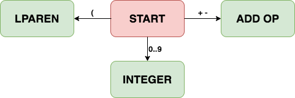

# COMP 232 - Scanner 1: Nested Cases Scanner

## Overview

Your first task is to implement a scanner (lexer) for the following grammar:

<a name="grammar"></a>

```
<program> ::= <statement> <EOF> | <statement> <program>

<statement> ::= <assignStmt> | <printStmt> | <repeatStmt>
<assignStmt> ::= <ident> = <expr> ;
<printStmt> ::= print <expr> ;
<repeatStmt> ::= repeat ( <expr> ) <statement>

<expr> ::= <term> | <expr> <addOp> <term>
<term> ::= <factor> | <term> <multOp> <factor>
<factor> ::= <ident> | <number> | <addOp> <factor> | ( <expr> )

<ident> ::= <letter> | <ident> <letter> | <ident> <digit>

<number> ::= <integer> | <float>

<integer> ::= <digit> | <integer> <digit>
<float> ::= <digit> . | <digit> <float> | <float> <digit>

<addOp> ::= + | -
<multOp> ::= * | / | %

<letter> ::= a-z | A-Z | _ | $
<digit> ::= 0-9
```

Note that the `|` characters in the grammar mean "or"; for instance, the production `<letter> ::= a-z | A-Z | _ | $` indicates that a `<letter>` can be any of the following:

* a lowercase english alphabet letter `a-z`
* an uppercase english alphabet letter `A-Z`
* an underscore `_`
* a dollar sign `$`

## Tokens and Lexing

Your first task is to decide which elements of the grammar above are the lexical tokens (from here on to be referred to simply as "tokens"). You have likely encountered a more formal definition for tokens and lexing; here we will think of the tokens in a simpler, more intuitive way: tokens are to statements as words and punctuation are to sentences. Alternatively, a token is a sequence of characters which can be treated as a unit with meaning in the grammar.

For example, if we were to tokenize the following english sentence:

`Nick, that is not a sentence.`

The result would be the following tokens:

```
< NOUN Nick >
< PUNCUTATION , >
< PRONOUN that >
< VERB is >
< ADVERB not >
< ARTICLE a >
< NOUN sentence >
< PUNCTUATION . >
```

Note that lexing is disjoint from syntax; a sequence of random words which make absolutely no sense as a sentence could still be lexed correctly, but issues would arise when parsing as an invalid sentence cannot be parsed to find any coherent meaning. Here, we are not looking to parse the input, only to lex it.

Look through the [grammar](#grammar) and list the token types.

HINTS:

* There are 13 token types, including `INVALID` and `EOF` (end of file).
* `number`, `digit` and `letter` are **not** token types.
* Left and right parentheses are separate types.
* There are two keywords. Each keyword has its own type. There is no `keyword` type.
* The different types of statements are not tokens, but are instead composed of multiple tokens; if tokens are "words", the statement types are analogous to "sentences".
* Tokens are **not nestable**; a token cannot be comprised of elements containing other tokens. That being said, tokens may have recursive definitions too allow additional characters to be "merged" into one token. In this case, the recursion must be "solved" so that the state machine will recognize sequence of characters correctly when read from left to right; for instance, the recursive `<integer>` definition cannot be encoded in a state machine as stated in the grammar, because an `<integer>` is not a single character.

## Finite State Machine

Now that you've identified all of the token types, you can create a finite state machine for tokenization. The state machine has been started below, and you must complete it:



The machine should have a single starting state (the `START` state). The machine's transitions depend on the value of the next character. For example, given the input `123`, we would start in the `START` state and then the `1` at the start of the input would cause a transition to the `INTEGER` state. Clearly the `INTEGER` state is not complete, as is it has no way to add the remaining digits (`2` and `3`) to the integer being created.

Whenever a character is read for which there is no transition out of the current state, the implication is that this character is the start of the next token, so the current token (whose type is determined by the state the machine is in) is complete.

Your state machine should treat keywords and identifiers identically; in our implementation, we will do some post-processing to differentiate between keywords and identifiers, so this does not need to be handled by the state machine.

Draw a state machine to construct all of the tokens as described in the grammar. Your state machine must be included in your lab submission.

## Lexer Implementation

You've now finished the theoretical foundation of the lexer to be implemented. Use the provided code as a starting point to complete a lexer for the provided grammar.

Open `scanner.h`, and complete the `TOKEN_TYPE` enum and the `FSM_STATE` enum. These will list the types of tokens the scanner will return, and the states in the scanner's underlying finite state machine. Note that these two are not identical; for instance, the state machine will include a single state for identifiers and keywords, but keywords will be split into their own token types during the lexing process.

Read the `TOKEN_VALUE` union. For each `TOKEN_TYPE`, decide what member of the `TOKEN_VALUE` union (if any) should be populated. Note that tokens whose type conveys all necessary information do not require any `TOKEN_VALUE`; for instance, storing the `"("` string in a left-parentheses token would be redundant.

Once you are comfortable with the code in `scanner.h`, move on to `main.c`. This main is relatively simple; it essentially lexes in a loop until the resulting token is an `EOF` token, printing and freeing each token in the process.

Note the first lines in the `main` function:

```c
if (argc > 0)
{
    if (!freopen(argv[1], "r", stdin))
    {
        printf("Failed to open file at \"%s\".", argv[1]);
        fflush(stdout);
        exit(1);
    }
}
```

`argc` is an integer denoting the number of command-line arguments, and `argv` is an array of strings containing these arguments. For instance, if you were to run an executable with the command `myExecutable myFirstArg mySecondArg`, then `argc` would be `3` and `argv` would contain the three strings `"myExecutable"`, `"myFirstArg"` and `"mySecondArg"`.

By now we should be familiar with `freopen`; we know this line is overwriting the `stdin` file reference so input can be more easily gathered from elsewhere. `argv[1]` is the string value of the first argument (since `argv[0]` is the executable itself); it should be the name of the file we wish to use as input.

We have a provided input file, `input.txt`. We need `argv[1]` to be the path to `input.txt` in order for the input from `input.txt` to be used. CLion allows us to provide program arguments in the Run Configurations; open the `Run` menu, select `Edit Configurations`, select the `scanner` executable and in the `Program arguments` box enter `../input.txt`.

Everything other than the `freopen` call in the snippet above exists to warn you if your file could not be opened.

Once you are comfortable with both `scanner.h` and `main.c`, you're ready to work on your lexer!

Open `scanner.c`. There are four `TODO`s in the file.

The intended functionality for `freeToken` and `printToken` should be intuitive, and we will not discuss them further here; they are described in their `TODO` comments.

The `checkKeywordOrID` function is meant to determine if a token should be an identifier token or one of the keyword tokens. It should compare its string argument to each keyword, and assign the appropriate token type for that keyword if the string is a keyword. Otherwise, the token is an identifier, and should be updated as such. Note that keywords do not need to store a string value (the token type alone conveys all of the information about the token) but identifiers do need a string value.

The `scanner` function should emulate your state machine to tokenize inputs, character by character, to create and return a single token. It will do so by reading 1 new character in each iteration of a while loop. It must use these characters (along with the current state of the finite state machine) to determine what state transitions to take, and to determine when to assign value to the token being constructed.

When a token is composed of multiple characters, you'll generally know it's "done" when you encounter a character that is not part of the token being composed. For instance, if your state machine is in the `INTEGER_STATE` and you encounter a semicolon, that semicolon is clearly not part of the integer-in-progress, so it must be part of the **next** token; the integer is complete and can be returned. When this happens, you'll want to first put the unused character back on the input stream so it can be reconsidered as the beginning of the following token. Check out the manual entry for `ungetc`.

Note that the while loop iterates until the token's type is assigned. As such, a token's type should not be assigned until the token is complete (i.e. its entire sequence of characters has been read). Tokens should not be returned in the while loop, as this would skip the line after the while loop which cleans up the buffer used to temporarily store string values.

Don't forget to deal with characters which aren't included in the grammar (see how `&` tokenization in the sample run below), and to consider allow white space characters (space, newline, carriage return and tab) to be used as separators between tokens.

## Sample Run <a name="sample_run"></a>

The following is a successful sample run for the provided [`input.txt`](./input.txt):

```
<IDENT, firstvar>
<ASSIGN>
<INT, 123>
<IDENT, asdf>
<SEMICOLON>
<IDENT, _secondVar>
<ASSIGN>
<FLOAT, 21.000000>
<SEMICOLON>
<IDENT, $var3>
<ASSIGN>
<FLOAT, 1.500000>
<MULT_OP, %>
<INVALID, .>
<FLOAT, 523.300000>
<SEMICOLON>
<INT, 4>
<IDENT, var>
<KEYWORD, repeat>
<LPAREN>
<INT, 10>
<RPAREN>
<IDENT, var3>
<ASSIGN>
<INT, 2>
<MULT_OP, *>
<LPAREN>
<IDENT, firstvar>
<ADD_OP, +>
<IDENT, secondvar>
<RPAREN>
<MULT_OP, />
<LPAREN>
<IDENT, firstvar>
<ADD_OP, ->
<INT, 2>
<RPAREN>
<SEMICOLON>
<KEYWORD, repeat>
<LPAREN>
<IDENT, firstvar>
<ADD_OP, +>
<INT, 2>
<MULT_OP, %>
<IDENT, secondvar>
<RPAREN>
<KEYWORD, print>
<IDENT, firstvar>
<SEMICOLON>
<EOF>


Process finished with exit code 0
```

## Submission Checklist

In your final push, don't forget to:
 
* include a clearly labelled picture of your state machine
* test your program with Valgrind Memcheck and fix any memory errors
* create inputs to more rigorously test your lexer (`input.txt` doesn't test everything)
* include screenshots of sample runs (matching your inputs) in your submission.
